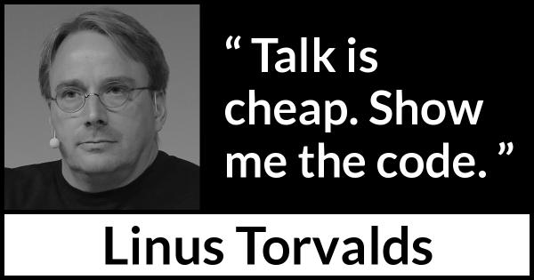

# Hi there 👋

## About Me
- Name: Xi Yang
- Alias: Alex
- Pronounce: He/Him
- Working on NLP, LLM, GenAI
- Good at large scale training across multi-GPUs and Multi-Nodes
- Experience in clinical trial cohort selection
- Want to learn deep learning driven drug discovery

## This is the Github Account for Xi Yang (Bugface) at Eli Lilly
- check my github at https://github.com/bugface

## Open to all coleborations on deep learning
- PyTorch
- Hugginface ecosystem
- Nvidia ecosystem
- PySpark

## GitHub Statistics
<!-- <a href="https://github.com/xiyang-aads-lilly/xiyang-aads-lilly">

 -->

## My Motivation

